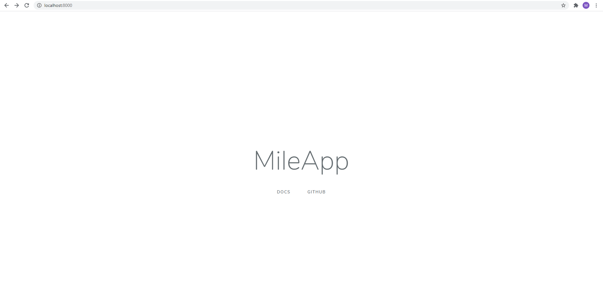
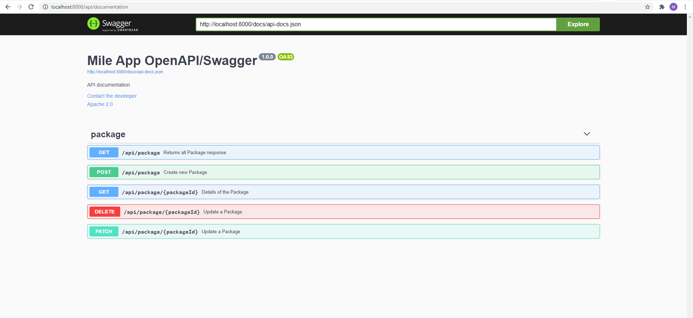

# MileApp-API

### About The Project
- laravel:7.0
- jenssegers/mongodb:4.0.0-alpha.1
- darkaonline/l5-swagger:7.0

### Getting Started
- cp .env.example .env
- Edit the with your config 

### Install Dependency

```bash
$ composer install
```

### Screen Shot





